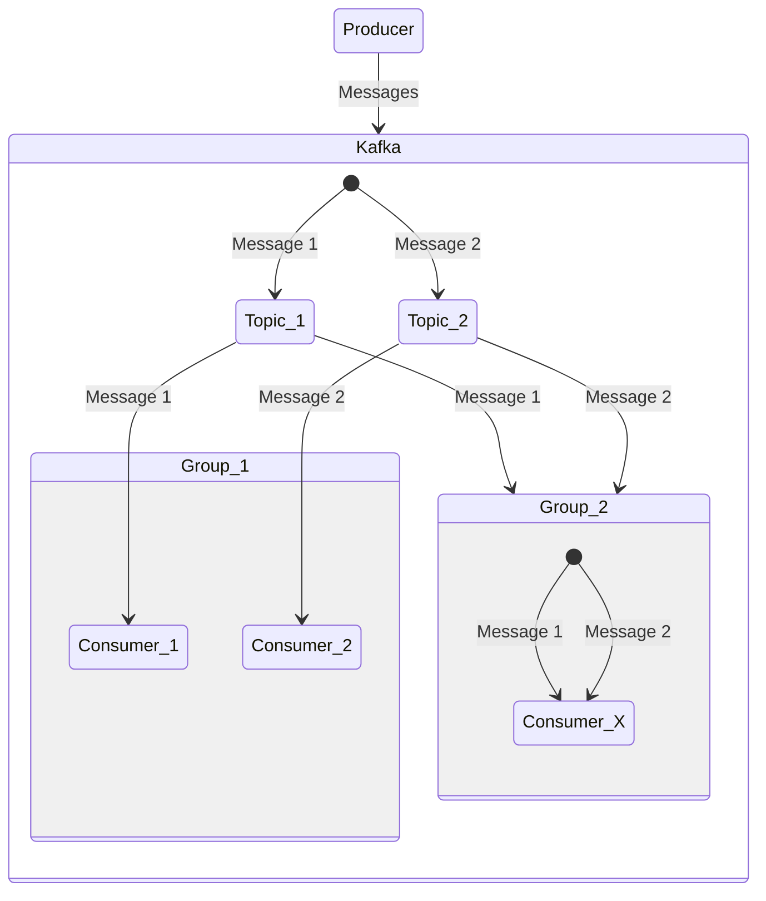
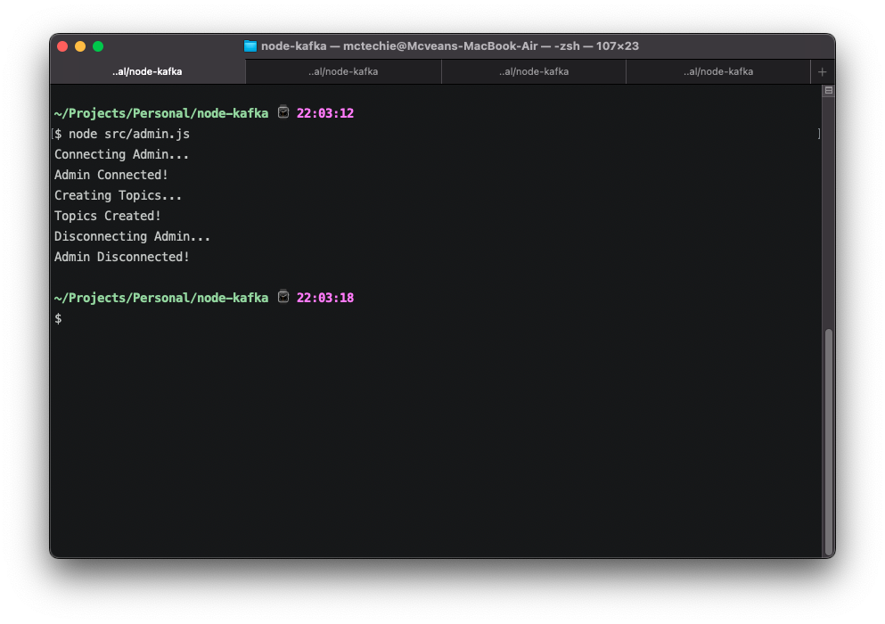
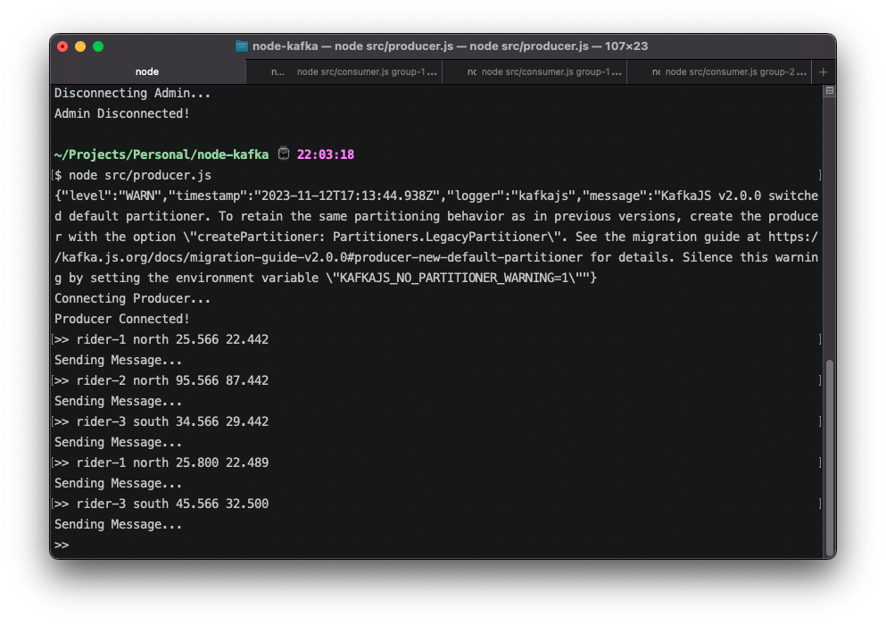
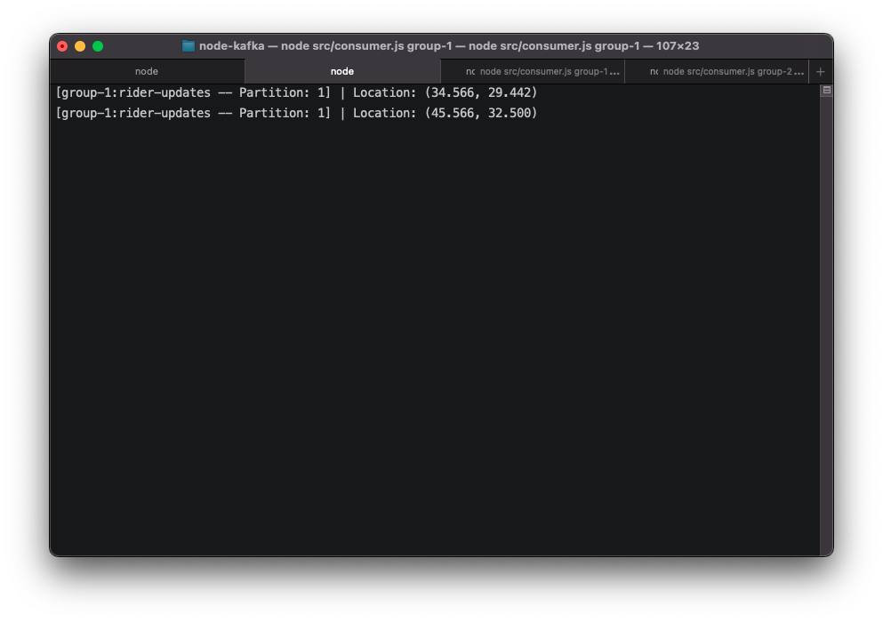
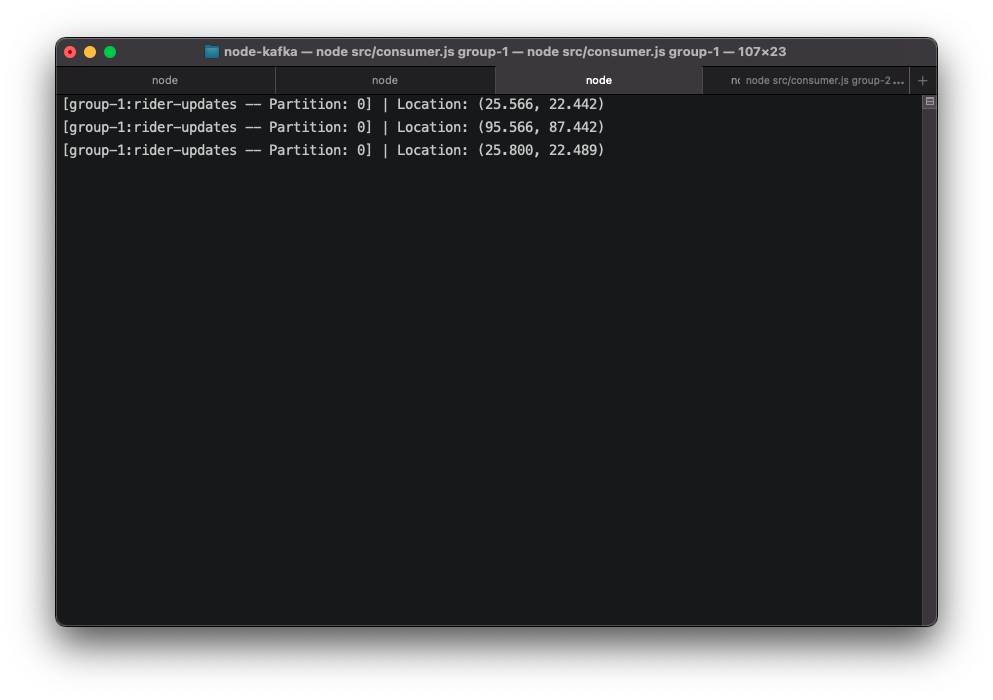
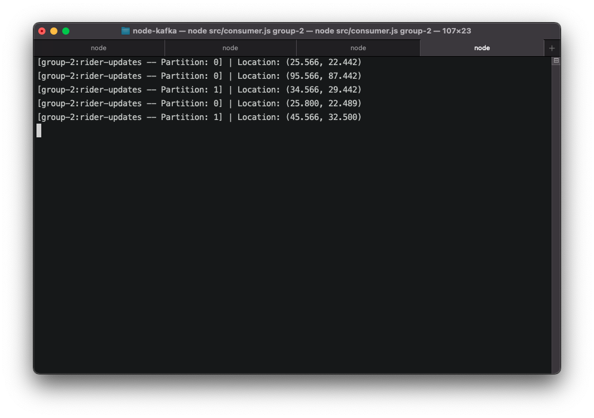

# Kafka + Node

> This is a simple example of how to use Kafka with Node.js created for the purpose of learning.

### Architecture



### Requirements

- [x] Docker
- [x] Node.js

### How to run

1. Clone this repository
2. Run `docker-compose up -d` to start Kafka and Zookeeper services
3. Run `pnpm i` to install the dependencies
   
   I have used `pnpm` to run the project, but you can use `npm` or `yarn` as well.
   
4. Once the docker containers are up and running, run `node admin.js` to create the **`topics`**
5. Now, run `node consumer.js group-1` to start a **`consumer`** with the group name `group-1`. Let's call this **`consumer-1`**
6. Next, create another terminal with the same command to start **`consumer-2`** with the same group name `group-1`
7. Next, create another terminal and run `node consumer.js group-2` to start the **`consumer`** with the group name `group-2`. Let's call this **`consumer-x`**
8. Finally, run `node producer.js` to start the **`producer`**.
9. To transmit a message we need to provide it in the following format:
    ```
    [RIDER_NAME]<SPACE>[ZONE]<SPACE>[LATITUDE]<SPACE>[LONGITUDE]
    ```
    ```
    eg: `rider-1 north 12.123456 12.123456`
    ```

    P.s. Zone can be set to `north` or `south`, since we have 2 partitions & subsequently support 2 consumers.
10. Transmitting a message with zone `north` will be consumed by one of the **`group-1`** consumers and **`consumer-x`**.
11. Similarly, transmitting a message with zone `south` will be consumed by the other **`group-1`** consumer and **`consumer-x`**.

### Demo

#### Admin Terminal



#### Producer Terminal



#### Consumer 1 (Group 1) Terminal



#### Consumer 2 (Group 1) Terminal



#### Consumer X (Group 2) Terminal


